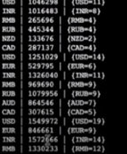
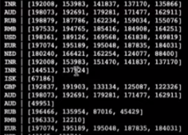

### KSQL Aggregates
KSQL provides a number of useful aggregate functions, such as MAX/MIN, SUM, COUNT and others.

In this exercise, we're going to see how we can create aggregated Tables from our KSQL queries.

#### 01 SUM
Let's first see how we can summarize clickevents by uri.

```sql
SELECT uri, SUM(number)
FROM clickevents
GROUP BY uri;
```
When we run this query we will receive an output list that aggregates, by number, the total count of number by amount, to date, for that URI.

You will notice that values continue to print out to the screen on a periodic basis -- thats ok, that just means the table-based representation is updating. You could instead create a table and then periodically query that table to view updates.

#### 02 HISTOGRAM
Another useful function is HISTOGRAM, which allows us to count the number of occurrences for a given value over a period of time. In this example, lets update the previous example with a histogram, so not only will we have the SUM of all number, but also the number of times we've had a uri reported at all.


```sql
SELECT uri,
  SUM(number) AS total_number,
  HISTOGRAM(uri) AS num_uri
FROM clickevents
GROUP BY uri;
```



#### 03 TOPK
Another common usage of stream processing is to find the top number of some value in a window.

Let's define a tumbling time window of 5 minutes, and select the top 5 numbers by uri.

```sql
SELECT uri , TOPK(number, 5)
FROM clickevents
WINDOW TUMBLING (SIZE 30 SECONDS)
GROUP BY uri;
```



You'll see the window begin to scroll by. As the top 5 numbers by uri updates for each of our currencies, the query will update. If you wait for 5 minutes, you will see the window reset.